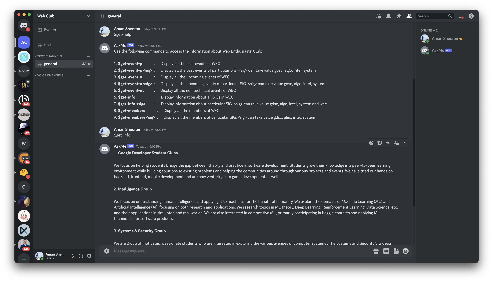
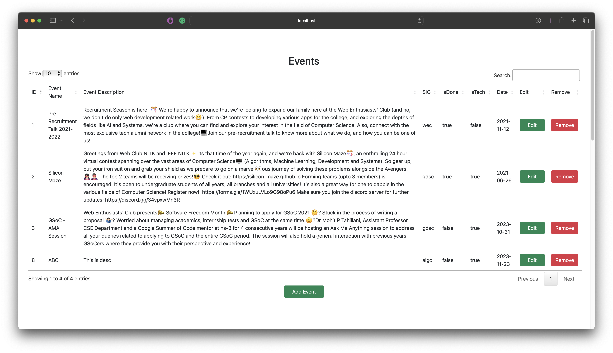

# AskMe
*Submission for GDSC Recruitment 2023*

**Description**

AskMe is a Discord bot which can be used to access information about Web Enthusiasts' Club.
****
**Setup Locally**

Just clone the project using git clone. All the dependencies are already included. It won't run on other system as the secret key for bot can not be shared with anybody else.
[Click here](https://discord.com/api/oauth2/authorize?client_id=1163439403910320189&permissions=8&scope=bot) to invite AskMe bot to your server.
****
**How it looks like**

****
**How it works**

This uses Discord API for python provided by discord. Admin Panel is made using ejs template engine and nodejs and express as backend.
****
**Video Demonstration**

[Click Here](https://youtu.be/8ydb38RFcEE) to view video demonstration
****
**References** :
<ul>
    <li>1. https://www.freecodecamp.org/news/create-a-discord-bot-with-python/</li>
    <li>2. Coding Ninjas (for ejs)</li>
    <li>3. https://ejs.co</li>

</ul>
